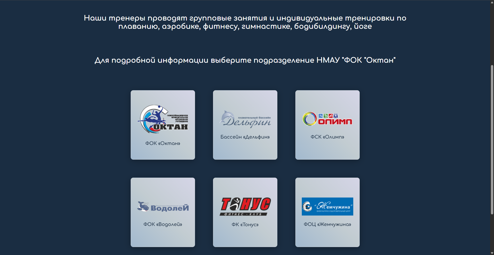

# Oktan - Website for a fitness company

  
    
  
  
  *fitness-center website*

## 🎨 About project

#### I suggested to my friend to create a new website for one fitness company in our city — Oktan.
#### I came up with the basic idea, page layout, etc., and then my friend implemented the functionality using <u>Flask</u>, <u>Pandas</u> and <u>Psycopg2</u> with a <u>PostgreSQL</u> database.
#### Long story short, my friend did the whole backend and some pages: [middelmatigheid](https://github.com/middelmatigheid/flask-oktan)
